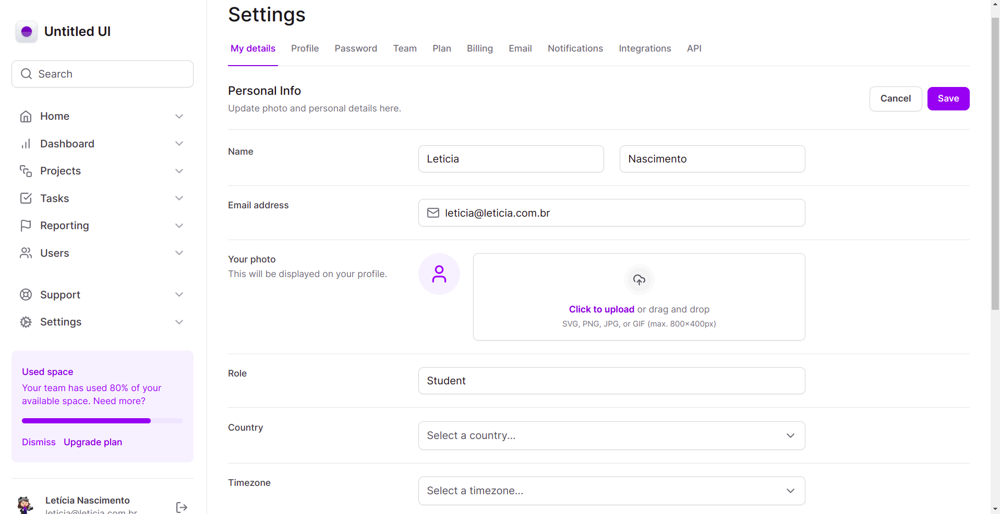
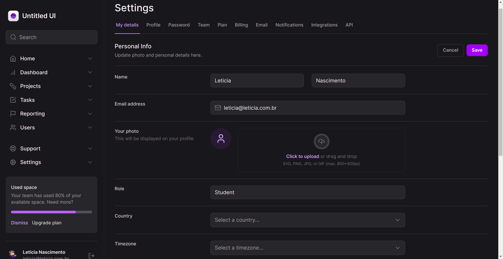
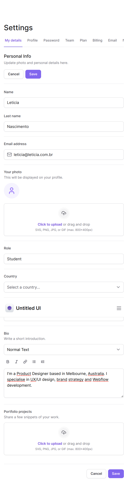
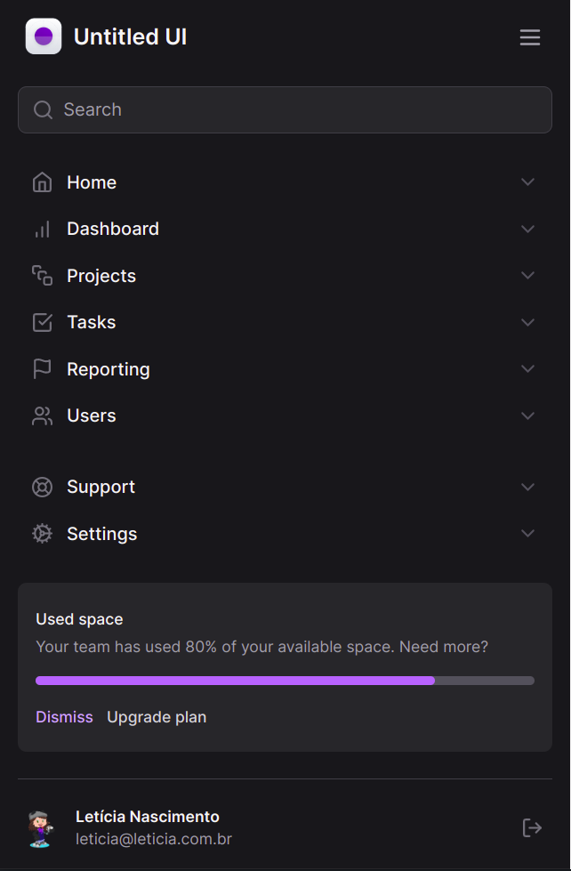

  <a href="#-tecnologias">Tecnologias</a>&nbsp;&nbsp;&nbsp;|&nbsp;&nbsp;&nbsp;
  <a href="#-projeto">Projeto</a>&nbsp;&nbsp;&nbsp;|&nbsp;&nbsp;&nbsp;
  <a href="#-como-rodar">Como rodar</a>&nbsp;&nbsp;&nbsp;|&nbsp;&nbsp;&nbsp;
  <a href="#-como-contribuir">Como contribuir</a>&nbsp;&nbsp;&nbsp;
  

 

# Dashboard with Tailwind and Nextjs

## 🚀 Tecnologias

Esse projeto foi desenvolvido com as seguintes tecnologias:

- [Nodejs](https://nodejs.org/en/) - v18.12.1
- [Npm](https://www.npmjs.com/) - 8.19.2
- [Nextjs](https://nextjs.org/) - 13.4.19
- [TypeScript](https://www.typescriptlang.org/) - ^4.9.3
- [Tailwindcss](https://tailwindcss.com/) - ^3.2.4
- [Tailwind-Variants](https://www.tailwind-variants.org/docs/introduction) - ^0.1.14
- [Radix UI](https://www.radix-ui.com/)
- [Formkit AutoAnimate](https://auto-animate.formkit.com/) - ^0.8.0
- [Framer Motion](https://www.framer.com/motion/) - ^10.16.1
- [Lucide React](https://lucide.dev/guide/packages/lucide-react) - ^0.268.0

## 💻 Projeto

Projeto desenvolvido com Nextjs para aprender alguns conceitos sobre Tailwindcss.

  

  

  

  

## ⚙️ Como Rodar

- Clone o projeto.
- Entre na pasta do projeto e rode 'npm install' (use 'yarn add' se for essa a sua configuração).
- npm run dev para rodar o projeto na porta indicada.

## 🤔 Como contribuir

- Faça um fork desse repositório;
- Cria uma branch com a sua feature: `git checkout -b minha-feature`;
- Faça commit das suas alterações: `git commit -m 'feat: Minha nova feature'`;
- Faça push para a sua branch: `git push origin minha-feature`.

Depois que o merge da sua pull request for feito, você pode deletar a sua branch.

## 📝 Licença

Esse projeto está sob a licença MIT.
